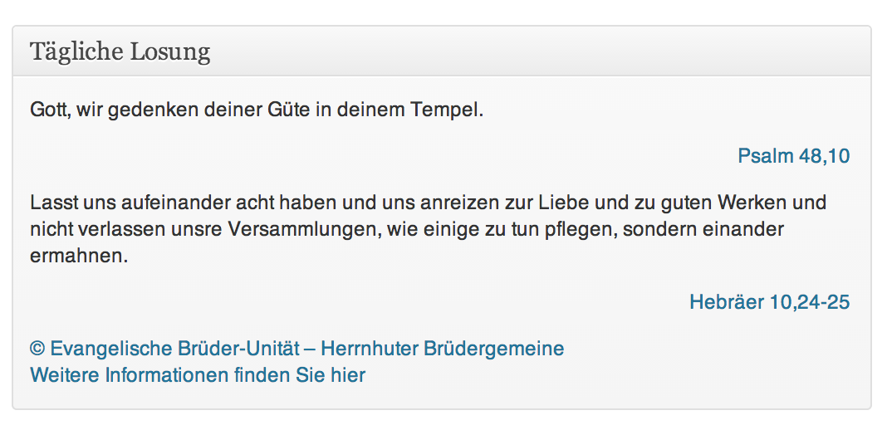

# LosungWP
* * * 

**Author:** [Hans-Helge B&uuml;rger](http://hanshelgebuerger.de "Hans-Helge Bürger - Webpage")  
**Date:** 27. August 2013
**Version:** v0.0.1
**Licence:** [GPLv2 or Later](http://www.gnu.org/licenses/gpl-2.0.html "GPLv2 or Later")
**Plugin URI:** [LosungWP Plugin Page](http://blog.hanshelgebuerger.de/losungwp "LosungWP - Plugin Page")

## Quick Installation
### Download [LosungWP v0.0.1](https://github.com/obstschale/LosungWP/archive/v0.0.1.zip)

---
### Über das Plugin

Das Plugin tut in der ersten Version noch nicht viel. Es liest aus einem XML File die Losungsverse des Tages raus und stellt sie als Dashboard Widget im Admin Panel da.

Dank geht an [Tobias Heß](https://github.com/hesstobi) der schon ein Losungs Plugin entwickelt, welches die Losung als Widget im Forntend darstellt.

---
### Changelog

###### v0.0.1
* Tägliche Losung als Dashboard Widget anzeigen

### Roadmap
* keine XML Datei verwenden
* Widget für Frontend ([Herrnhuter Losung](https://github.com/hesstobi/herrnhuter-losung-widget))
* Options einbauen

---
## Licensing

Copyright 2013 Hans-Helge Buerger  (email : mail@hig-podcast.de)

This program is free software; you can redistribute it and/or modify
it under the terms of the GNU General Public License as published by
the Free Software Foundation; either version 2 of the License, or
(at your option) any later version.

The Losungen of the Herrnhuter Brüdergemeine are copyrighted. Owner of
copyright is the Evangelische Brüder-Unität – Herrnhuter Brüdergemeine.
The biblical texts from the Lutheran Bible, revised texts in 1984, revised
edition with a new spelling, subject to the copyright of the German Bible
Society, Stuttgart.

This program is distributed in the hope that it will be useful,
but WITHOUT ANY WARRANTY; without even the implied warranty of
MERCHANTABILITY or FITNESS FOR A PARTICULAR PURPOSE.  See the
GNU General Public License for more details.

You should have received a copy of the GNU General Public License
along with this program; if not, write to the Free Software
Foundation, Inc., 59 Temple Place, Suite 330, Boston, MA  02111-1307  USA
